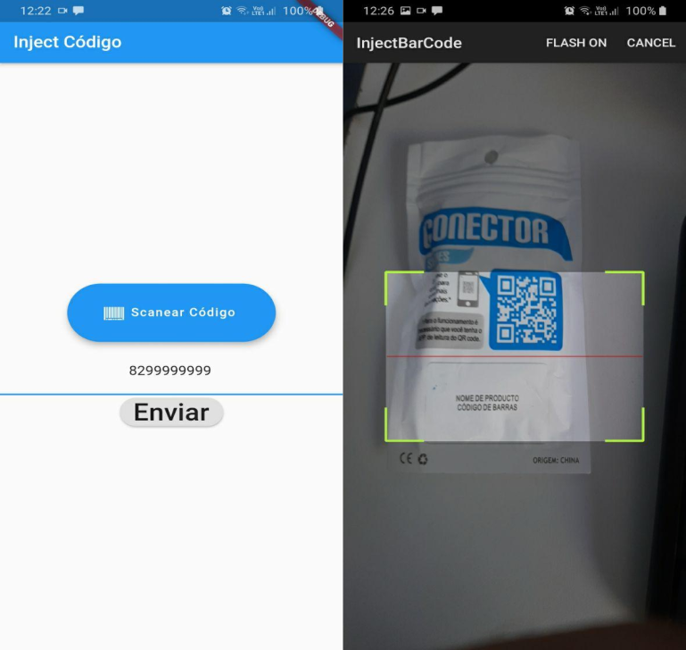

# Código de barras + chatbot Whatsapp

Esta é minha primeira aplicação em flutter desenvolvida para empresa [plusSoft](https://novo.plussoft.com.br/).

## Sobre

Este simples aplicativo escaneia um código de barras ou QR code e encaminha para um chatbot do Whatsapp para
que retorna algo devidamente programado. Esse chatbot integra-se a um sistema de vendas da empresa.

### Demo:

#### Disclaimer

Pode conter badsmells, portanto, ao longo do meu aprendizado com programação reativa, irei melhorá-lo. 
O projeto está totalmente funcional.
